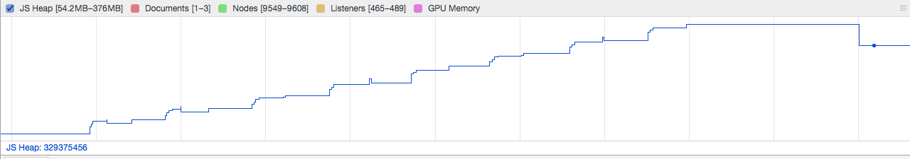
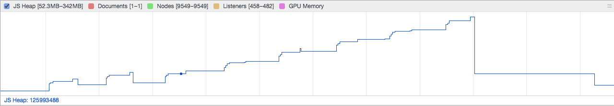

Here's a pretty interesting bug that a mate recently ran into that piqued my interest.

Picture this: you're writing an MVP for an application which has some data access components - it might look like this:

```js
class MyComponent {
  constructor($http) {
    this.$http = $http;
  }

  doSomething() {
    this.$http.get('http://myapi.com/some-endpoint').then((response) => {
      console.log(response);
      this.data = response;
    });
  }
}
```

This probably looks familiar to a lot of you Angular developers out there.

Pretty innocuous, right?

What if I were to say that there is a reasonably annoying potential memory leak here? Most people I've spoken to have either scoffed or tried _really_ hard to find something in the code that isn't there.

Let's take a look at what happens as this code ran over time:



Hmm... interesting. We seem to be building up a fair bit of memory usage and nothing seems to be garbage collected. Why?

It's probably not going to be the constructor for this class, so let's write that off. I'll also add in the assumption that Angular's `$http` service isn't causing any leaks for us here (although it might do - but that's a separate discussion alogether). This leaves us with the `doSomething()` function. We've all retrieved data like this in Angular applications a billion times before without any problems, right?

The solution to answering _why_ this memory usage was accumulating had to do with how frequently `doSomething()` was being hit and the size of the data that was being returned in the response to the API call.

What was happening that certainly widened my eyes was that the `console.log(response)` was keeping a reference to `response` and thus not being garbage collected. I thought this was super strange because I couldn't work out why.

By now, some people have probably worked this out. The browser developer tools uses this reference which allows us to inspect objects while we've logged! One of the reasons why you shouldn't keep client-side logging in your production code.

This is how things look once the logging line is removed:



As you can see, the garbage collector is now able to kick in and remove references to our objects. I'll also add here that this problem would arise regardless of the framework used here. It will happen even if you craft an XHR request manually and log the results.

I'm not ashamed to admit that I didn't work this one out myself, but I certainly loved learning about it and trying to assist in diagnosing it.

Let me know what you think about this!

-Dave
