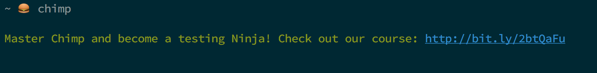

This is a great one.

Like most developers, I like to test things. At the moment, using [Chimp](https://chimp.readme.io/) alongside [Cucumber](https://github.com/cucumber/cucumber-js) for writing end-to-end tests is pretty nice, in my opinion. We use it at my current workplace and it's great. However, this looks like a recent interesting play from the Chimp crew.

Now for the fun stuff.

After installing Chimp on a new machine and going to execute it, I noticed something a little different to what I'm used to seeing when running command line utilities... see if you can spot it - you'll need a keen eye.

Yep, you guessed it - advertising has infected your precious, pristine, pure terminal! Although I'm not sure how pure that hamburger terminal of mine is...

This took me by surprise. As far as I can recall, I don't think I've seen links shoved in front of the user that lead to paid services.

Let me also say here that:

1. I love Chimp.
2. I think their developers do a great job.
3. I'm not sure I think this is necessarily a bad thing.

It does leave me quite confused, though. Could we start to see this happening more often? We all use command line tools all the time - why not start putting things into our eyeline?

I tried Googling for examples of this but wasn't able to find anything substantial. Maybe I am way behind the 8-ball on this one and it's happened at scale before.

What sort of things could this lead to? Answer: I'm not too sure.

Let's discuss this.
