## I built a keyboard

I made a keyboard – let me tell you about it! I'm even typing this post using the keyboard I built. How meta.

This has been a fairly involved process so there is a lot to discuss. The main goal of this post is to talk people through the things I went through and what I wish I knew before I had started this project. This post will likely be edited a few times before I am happy with it so feel free to check back for added explanations/thoughts/photos.

## Motivation

The most common questions/statements I got when telling people that I was building a keyboard from scratch were:

- "Why not just get a keyboard online or from a store locally?"
- "That's going to cost too much money."
- "You'll never be able to make a keyboard as good as something commercially manufactured."
- or just "why?"

There's a really simple answer to what motivated me to do this. I wanted to see if I was capable of doing it. I'd never designed anything before, dealt with manufacturing companies, sourced materials like the ones I used, or wired something like this up before. From a glance it seemed to me like I would be able to do it with a solid amount of effort so I decided to go for it. To me, this was a hobby project, and hobby projects can run some people up into the thousands (think high end RC cars or models) so this was financially feasible for me to pursue.

In regards to the build quality – yes, I am aware that this design has flaws (will be discussed later) and that the overall quality isn't as good as, say, a Ducky, but I can definitely make something that is functional and isn't completely terrible aesthetically (in my opinion).

I'm a huge fan of DIY projects and as cliché as it sounds, I'm hoping that this post will help people realise that they can do this sort of stuff if they put their mind to it (not just limited to keyboards).

Plus, who can have enough keyboards, right?!

## Background

Just a quick bit of a background on myself:

- My name is Dave
- I live in Australia
- I like long walks on the beach
- I'm a programmer by trade
- I don't have a creative bone in my body
- I've never done something like this before
- Everything that didn't involve programming for this project was almost completely foreign to me before I started working on it

## Disclaimers

Probably a good idea to establish a few things first, just so we don’t get off on the wrong foot :)

- I am not a designer, so I’m aware that things could be prettier
- The design was _largely_ inspired by other DIY 60% keyboards (i.e. matt3o’s BrownFox design).
- I was not aiming for perfection for this first keyboard build. It was to confirm that I was capable of being able to build a functional keyboard. My second build will largely be my own design (hopefully) and I will be aiming for as close to perfection (by my standards and preferences) as possible. This will obviously take a long time to do, but I’m absolutely willing to put the effort in given how much satisfaction I got from this first build.
- I am _terrible_ at soldering. Yes, I am aware that I have the fine motor skills of a 100 year old man. I blame this on being left handed and having the least steady hands on the planet.
- I am not a photographer. My photographs are all taken with my phone and my shaky hands (see previous point).

Okay, disclaimers out of the way – let’s talk about making a keyboard.

## Materials

There’s a fairly long list of things I required for this build.

Check out my workstation before I started building:
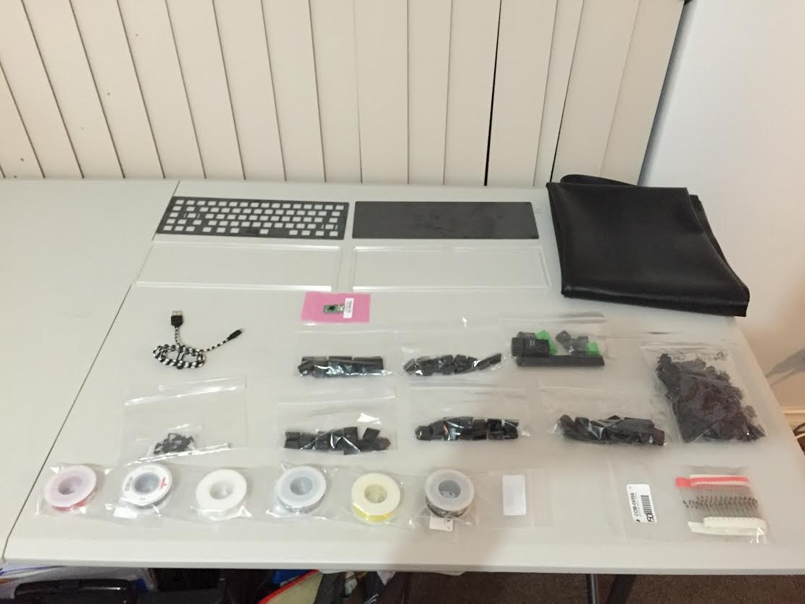

Here is a list of everything and where I sourced them from:

### Enclosure material

- Sheet steel (from [Dicandilo](http://www.dicandilo.com.au/)) – For the top and bottom layers, I went with 1.6mm sheets. One thing of note: steel is heavy. If you want your enclosure to be light, go with a lighter metal (i.e. aluminium).
- Acrylic (from [All Acrylic Shapes](http://www.allacrylic.com.au/)) – The middle two layers I went with 6mm thick clear acrylic sheets. This, to me, was aesthetically pleasing and also stopped my enclosure from being too heavy for my girly arms to pick up.

Here’s a photo of the enclosure materials from the day I picked them up:
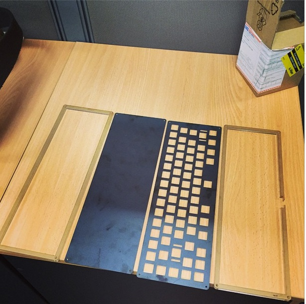

### Switches and keycaps

Such a contentious topic. Truth be told, I have no strong preference when it comes to Cherry switches. I’ve been using browns for a while now on my WASD v2 keyboard and saw no reason to change, so I went with Cherry MX Browns. I purchased from from [gonskeyboards](http://www.gonskeyboardworks.com/).

I purchased my keycaps for this build from [WASD Keyboards](http://www.wasdkeyboards.com/). Pretty basic set I know, but they get the job done.

### Internals

The guts of the keyboard. Everything except the insulation rubber (which I got from eBay) I purchased from [Little Bird Electronics](http://littlebirdelectronics.com.au/)

- Diodes – 1N4148. This seems pretty standard for this sort of stuff.
- 22 AWG hook-up wire. I strongly suggest you get a lot of different colours as it makes it much easier to track when you are soldering things up. I got black, brown, grey, red, white and yellow. I’d actually recommend using a slightly thinner gauge wire for this build. It will be easier to manipulate and much easier to wire up the columns.
- Teensy 2.0. This is a pretty sweet microcontroller – it has more than enough pins (just) to hook up all the rows and columns and is impressively tiny (as the name suggests). This makes it really easy to mount inside the enclosure and not get up in anything else’s business.
- Insulation rubber. I picked up some 0.8mm neoprene rubber off eBay and I definitely don’t regret it. Easy to work with, cheap, and looks pretty slick. The rubber was used on the inside of the back plate and underneath the Teensy board to stop shorting of pins. Probably a good idea since we’re dealing with electricity.
- A mini USB cable. I was silly and assumed I needed a micro USB cable, since everything else uses that. I was sadly mistaken.

## Cost

Here is a rough breakdown of how much I paid for everything. Please keep in mind I bought a little extra of some things (diodes, wires etc…) so some prices may seem quite high:

- Steel + cutting: \$40
- Acrylic + cutting: \$110 – Yep, acrylic over here is more expensive than the steel.
- Switches: \$80
- Diodes: \$20 (I bought extra)
- Wiring: \$18 (I bought extra)
- Keycaps: \$100. This could be greatly reduced if you got them as part of a group buy or you didn’t order a few individually printed ones like I did.
- Teensy: \$20
- Insulation rubber: \$20
- Mini USB cable: \$5

## Other Things You Will Want

- A decent soldering iron. You will thank yourself later. Also note: you will burn yourself many times throughout the build. Might as well do it with a fancy iron!
- LEADED SOLDER – I started the build without leaded solder and oh dear...
- Wire strippers. Do not use your teeth. Do not use someone else’s teeth. Do not use a scalpel. Use wire strippers.
- A decent working surface/area. A big table with a good cutting mat to work off is pretty good. I just picked up a cutting mat from my local electronics store, [Jaycar](http://www.jaycar.com.au/).
- Adhesive for the insulation rubber. Make sure that it won’t corrode the rubber or steel. I managed to get my hands on [these guys](http://www.jaycar.com.au/p/NA1522) and they are absolutely awesome.
- Solder braid. You will get solder in places you don’t want it. You will want to get rid of it. Solder braid is your best friend. All hail the braid.
- Tweezers. You are working with a small amount of wiggle room and you will wind up dropping something between the cracks or you will need something to feed a cable through a small gap. Tweezers are a huge mate in tough times like these.
- Patience.

Big emphasis on a decent working area. You will have a lot of stuff to keep track of and not having to stack things on top of each other makes a huge difference. Here is what my workstation looked like one Friday evening:
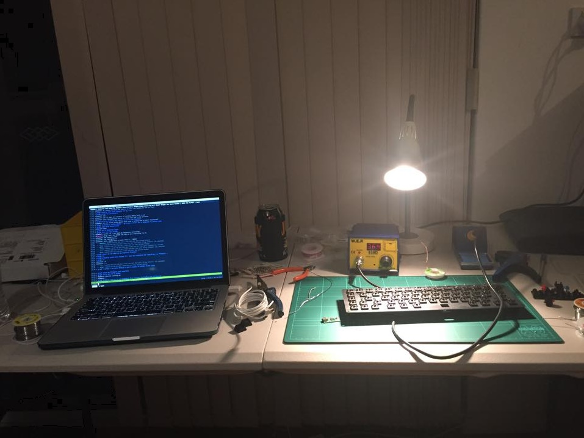

## The design/build process

**The enclosure**
I’m trying to work out what was the hardest thing to do for this build and I have a feeling the enclosure was it. I had absolutely no clue to begin with what I even wanted my keyboard to look like. I thought just trying to replicate my WASD v1 but wanted as little bezel as possible. I also liked the idea of a very simplistic design. I stumbled across matt3o’s BrownFox build and fell in love with that instantaneously and decided to base my design around it.

From here it was a huge learning process. I had all the dimensions of the switches so I knew how big each hole in the design needed to be, and I even knew the dimensions of the keycaps I was going to be using so I knew how far apart the holes needed to be, what I _didn’t_ have a clue with was how to translate this into a drawing that a manufacturer knew how to build. I ended up going with the DraftSight software and, not to be too negative here since it got the job done, I was a bit disappointed. This probably has nothing to do with the software, more that I am not a draftsman. The software had a reasonably steep learning curve (in my opinion) with very little online support other than the instruction manual. This took a lot of tinkering around to get used to doing the things I needed to do which was mostly being able to draw lines to scale and provide their measurements. Sounds easy; it didn’t turn out to be for me (once again, it’s probably because I have had no experience here).

I used the BrownFox drawing file as a base and changed things how I saw fit. This was mainly minor tweaks.

I had to then find people to source the building materials from and cut them. Fortunately the two places I found for the steel and acrylic respectively sold _and_ cut them. This was pretty handy. As for what these people expect so they can help you out:

- Provide a CAD drawing or PDF of your design, indicating scale (if it isn’t 1:1)
- Indicate the unique distances of cutouts. I sucked at this. It made my drawings very messy/sketchy, but it was necessary and I found most places didn’t want to work this out themselves even if you provided the dimensions/scale. This is what my top panel ended up looking like when I sent it off to the manufacturer:
  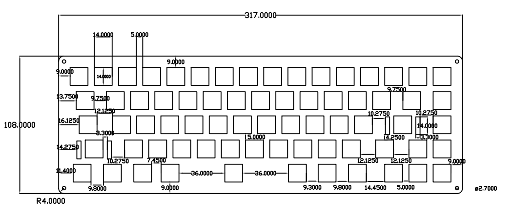

### The internals

Cool, so we can fast-forward and I now have my enclosure materials. The most interesting thing here is now I have my switches. The switches can be mounted on the plates and we can begin soldering the diodes. Exciting stuff. This is was just after I finished putting the switches in. Let me tell you now how satisfied I was when the switches mounted perfectly on the steel plate. The cherry switches occupy a 14mm \* 14mm hole. In fact, it’s probably best that you become acquainted with the [Cherry MX Datasheet](http://media.digikey.com/pdf/Data%20Sheets/Cherry%20PDFs/MX%20Series.pdf) if you plan on using Cherry switches.

This was the first tangible milestone of the project. Exciting times!

Now here’s another really common question I got: “Did you do this with a PCB or hand-wired?”. I opted for the hand-wired route for this build. At the time, I thought it would mean a quicker turnaround, which I later realised was not the case. However, I do have an appreciation for doing the hand-wired build, as it adds that ghetto factor you can’t get with a PCB.

### Soldering

Okay, so the switches are in so the soldering should be a piece of cake, right?! Wrong. This took me a really, really, really, really long time to do. I think this mostly stemmed from my ultra shaky hands, which don’t lend themselves to fast or good soldering. Allow yourself plenty of time to do this if you plan on hand-wiring your board.

First of all we need to connect a diode up to each individual switch and then connect up each row of diodes with each other (there are 5 rows total). [Here](http://www.dribin.org/dave/keyboard/one_html/) is an extremely useful article that explains the importance of the diodes and how they work. Basically it allows us to be able to identify which rows and columns are currently active during the event of keypresses.

It’s also a pretty good idea to pre-solder a glob onto each of the pins on the switches, as this will save you a lot of time later. The diodes get soldered to the top left pin on each switch with the **_black stripe on the diode facing the bottom (i.e. the row with the spacebar on it) of the keyboard_**. There will be nothing worse discovering this problem once you think you’re done building the keyboard.

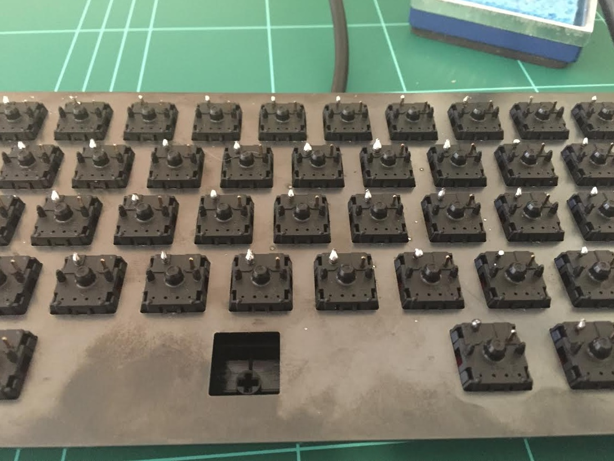

It’s also probably a good idea to pre-bend your diodes at a 90 degree angle before soldering, too. If you do this, your rows will be a) infinitely easier to solder and b) will look like they weren’t done by a 3-year-old who has had a litre of red cordial. Unfortunately, I did not pre-bend my diodes thinking I wouldn’t have a problem here. Guess what, the 3 year old did the soldering!

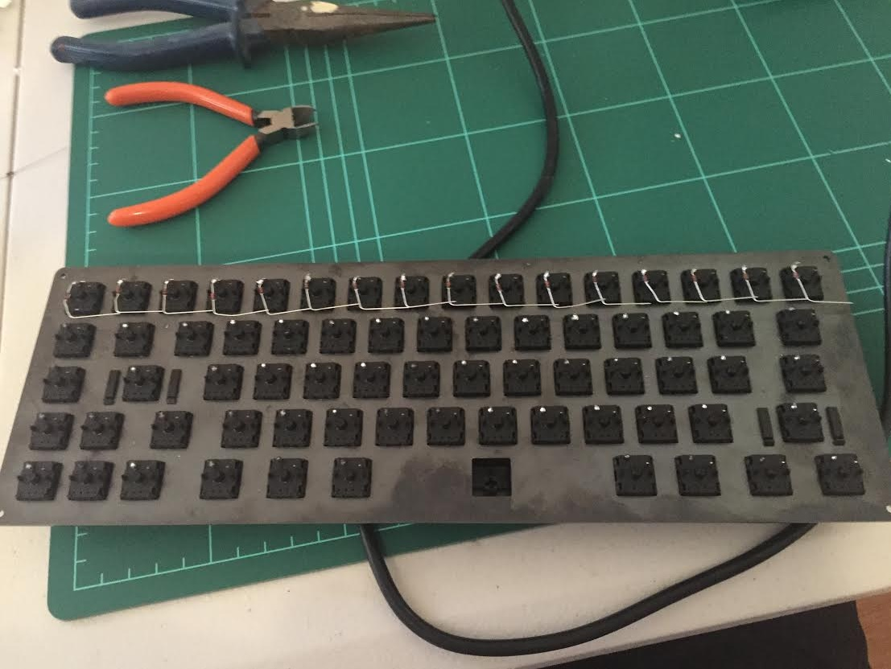

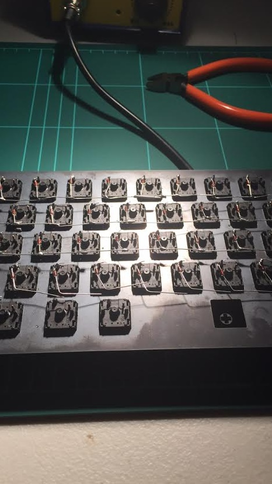

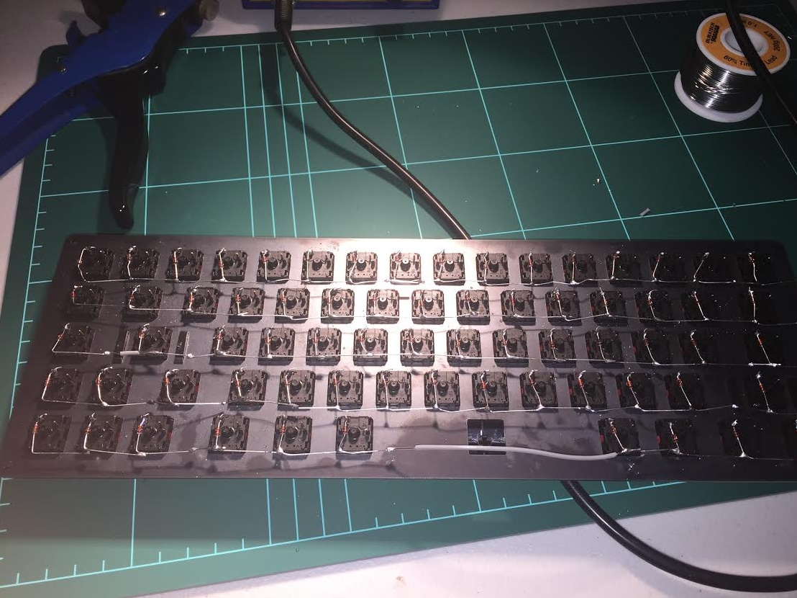

Sweet, so we’ve soldered on our diodes and connected up our rows. You’ve probably found this to be reasonably time consuming. Unfortunately, connecting up the columns is also just as time consuming and requires you to pay extra attention because if you don’t make the cables up right you will certainly get some shorts going.

I’ll just quickly add here, if anyone doing a hand-wired build has a better/more efficient method of making the cables for the columns, please let me know because this part sucked for me and I couldn’t work out a better alternative.

So we now need to hook up each individual column of switches. My build has 16 columns but you can have as many or little as you like depending on how you’ve designed your layout. The column wires connect to the right-hand pin on each switch (i.e. the pin that you didn’t connect a diode to).

What I did to create my cables for the columns was get a length of wire and using my cable stripper I removed chunks of cable about the length between the pins in the column and then fed those chunks back on, leaving gaps to connect the wire to the pins. It looked something like this:

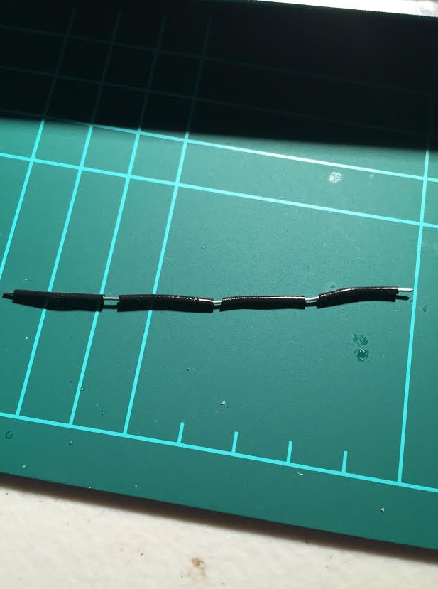

From here it was just a matter of connecting up each of the columns. Just keep in mind here, if you’re working with this gauge of wire, due to the small working space inside the keyboard it’s actually rather difficult to feed these lengths of cable through from the top of the column to the bottom. For these circumstances I just made the cables shorter and used multiple cables to connect up the column.

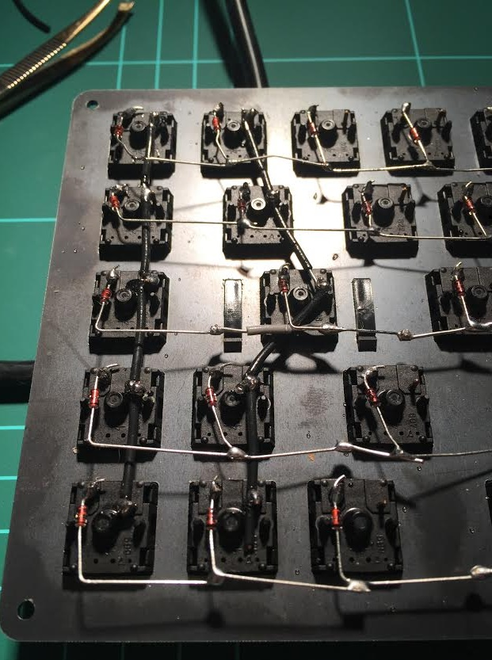

The column on the left uses just the one cable. The column on the right uses a couple of cables. As long as everything is joined up it’s all good.

One you’ve hooked up all the cables then all we need to do is connect them to our microcontroller.

Enter the Teensy.

This little guy does a lot.

All I’ve done in the picture above is solder a wire to each of the pins I will be using. Remember you have to avoid pin D6 and any of the power/ground pins. The pinout for the Teensy 2 can be found [here](https://www.pjrc.com/teensy/pinout.html).

Now would also be a good time to attach the Teensy to the keyboard so we make sure that it will all connect up nicely. I put mine near the gaps where the spacebar switches are. This is probably an ideal spot in most hand-wired builds. Remember to put some insulation between the bottom of the teensy and the steel plate. This is where those adhesive strips I bought came in super handy.

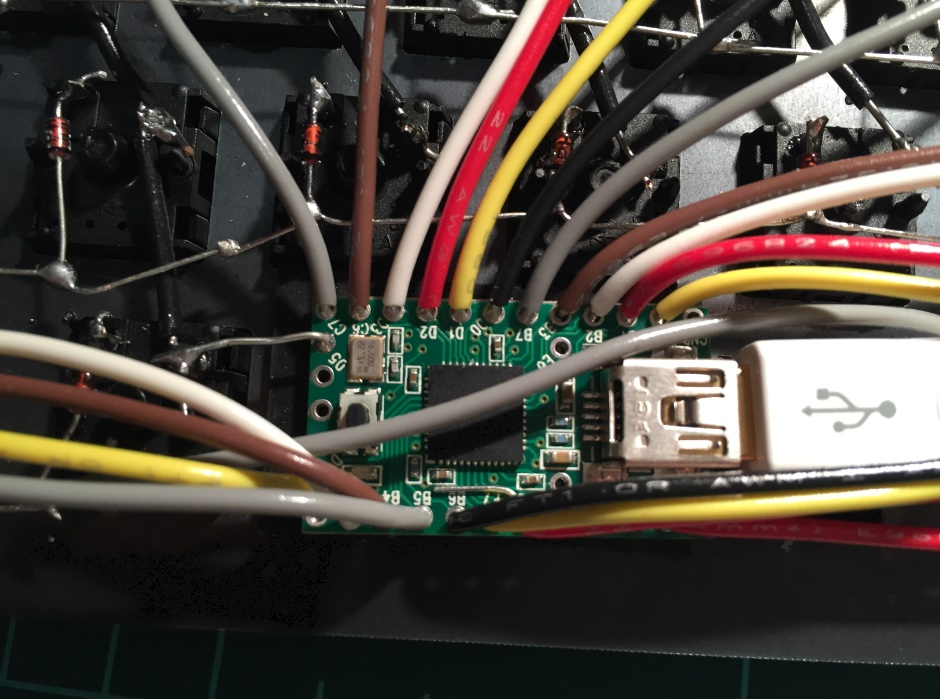

The adhesive is making sure that the Teensy board isn’t going anywhere.

Now it’s just a matter of connecting a wire from the teensy to each of the rows and columns. It doesn’t matter where on each row/column you connect the wires so do whatever works for you. I had a couple of really sad moments at this stage. I wanted to do a good job of routing the cables underneath the row/column wiring but the wire was just too thick to do a good job of this so I had to go against my preference and “spider” out over the top of my existing cabling.

One other really important thing. Make sure you note which pin on the Teensy board is connected to which row/column. Write this information down somewhere. You’ll need it when it comes to programming the firmware.

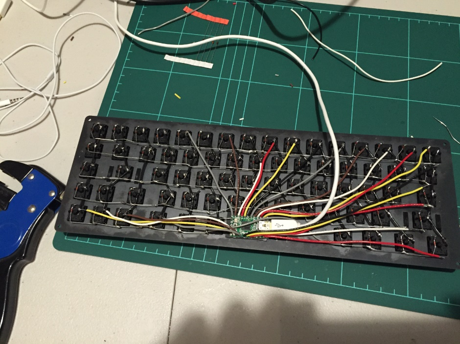

If you have a keen eye you’ll see that the yellow wire on the top right of the above image is connected to a diode instead of the pin on the right to it (because it is supposed to be connecting a column) – I did fix this after realising it after loading my firmware and noticing that column wasn’t working at all.

At this stage, assuming we’ve done everything right our soldering is now done.

Before we close up the enclosure, we need to put a rubber inlay on the inside of the bottom steel plate to avoid any accidental shorts. Once again, the adhesive strips come in handy here.

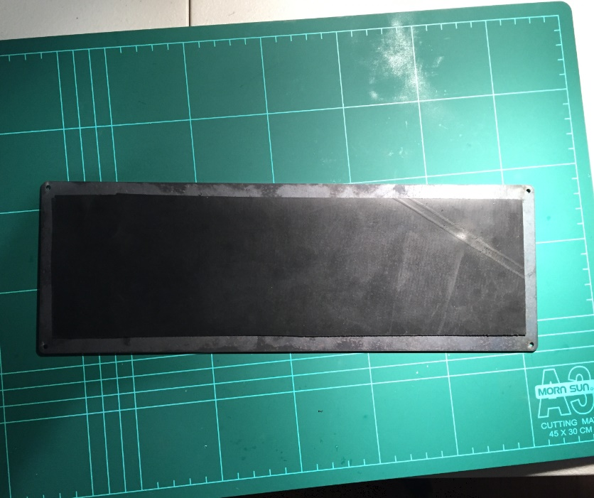

On to the programming part of this build.

### Firmware

This section is going to be really short.

I have an embedded software background so I understand what is required to drive the hardware we’re using so I thought I’d give writing the firmware from scratch a crack. I then found after not too long (i.e. getting a key to work) that it’s probably a better idea to see if someone had written some sort of framework to make our lives easier. Fortunately there is. You can find the Github repository for TMK’s keyboard project [here](https://github.com/tmk/tmk_keyboard/). I _strongly_ suggest that you use this as a base and follow [matt3o’s firmware guide](http://deskthority.net/workshop-f7/how-to-build-your-very-own-keyboard-firmware-t7177.html) to get the firmware going on the Teensy if you don’t have any prior knowledge of how to write code to drive a keyboard.

If you’re having trouble getting the firmware going on your Teensy board please let me know and I’ll do my best to assist you :) I know this section is brief, but there really isn’t anything I can tell you here that matt3o hasn’t already covered in great detail.

## The finished product

Once you’ve hit this stage, you’re done! This is how my keyboard turned out. I left my WASD v2 in the shot just to let you see a bit of a comparison.

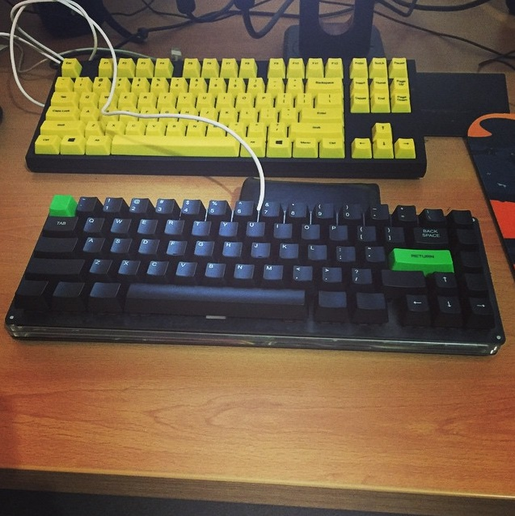

As for how the keyboard handles, it’s rock solid. It has a lot of weight to it so it doesn’t feel like it’s going anywhere and the keys feel fantastic. I’m 4,000 words into this blog post already and my fingers don’t feel fatigued at all and typing is a pleasure.

Let’s discuss a few last things. Then I will let you go in peace :)

## Flaws in my design

### The spacebar

This actually turned out to be a blessing in disguise. As mentioned earlier, I thought that having 3 switches for the spacebar would work out quite nicely. When I had 3 switches in the spacebar was _way_ too stiff. I then had the idea to change the 3 spacebar switches with cherry reds but wasn’t patient enough to get the switches in. In the end I decided to just take out the middle switch altogether. I was a bit nervous about this as I didn’t know if it was really going to make much of a difference. Boy was I relieved when I started using the keyboard. The spacebar is pretty stiff but I _much_ prefer it over any spacebar I’ve used on other keyboards. It feel much easier to activate the key which allows me to type easily.

### Stabilisers

I slightly miscalculated the space for the stabilisers to slot in. This is easily rectified by our friend Mr. Dremel.

### Right modifier keys

This was probably, in my opinion, the only _huge_ flaw in my design. I miscalculated the bottom row of key cut-outs which left me with a bit of a gap between my right modifier keys and the start of the arrow keys. I haven’t lost any sleep over it, but I will definitely be fixing that up for my second keyboard build.

I’m sure there are a tonne more flaws with how I went about things and would love to hear your constructive criticism about them. Anything that I can address in future iterations I’d be keen to hear about.

## What's happening next?

### Current build

There are a couple of things that I want to tidy up with my current build before labelling it 100% complete:

- Polish the steel a bit more so it has a more professional looking finish to it.
- Find a backslash key with the right profile (i.e. the same profile as the number keys).
- Order in some bolts to bolt up the enclosure. At the moment it’s still a bit wobbly because I’ve just got some pins holding the enclosure together.
- Order in a nice mini USB cable. The one I have at the moment is a bit ugly.

### Next build

Here is a list of things that I will definitely be doing for my next build. I really will be aiming for perfection for my second build as I believe I have learnt enough valuable lessons from the first build to take a serious crack at making something that rivals a professional build.

- Design and have a PCB manufactured.
- Use a decent set of keycaps (I have a set of DSA Dolch keycaps lying around so I may use them).
- Use treated steel for the top and bottom layers. The steel I used for this build looks a little bit scrappy. Having something with a smooth and consistent finish would be nice.
- Design a layout that is largely “my own”. I drew a lot of inspiration for this layout from other DIY jobs but I want to have a long hard think about what I really want out of my next keyboard and come up with a layout that truly fits it.

## Acknowledgements

I can’t stress how appreciative I am for all of the help and assistance I received during the course of this project. I literally would not have been able to do this without the help of so many people. In no particular order, here are the people/communities that I am thankful for (apologies if I have missed anyone specific out – I will be updating this list as more people come to mind!):

- **matt3o** – This guy is a beast. Anyone in the DIY keyboard community already knows this. I saw his BrownFox build and immediately had a million questions I contacted him about and he answered every last one in detail. Over time he helped me with a lot of things and his keyboard builds are largely what inspired mine.
- **Gon** – This guy was another really helpful person involved with this. He runs an awesome DIY keyboard site here and has been making stuff that I could only dream of making for a long time.
- **Damon** (my house-mate) – Damon has to put up with more of my nonsense than anyone else on the planet. He has also acted as a huge sanity checker for my ideas and helped me source a lot of ideas for this project.
- **Peter** (he’s a bro) – Peter has always been a sounding board for things that I work on. He has taken a particular interest in this project and has been offering interesting opinions towards it. We are both going to be working on keyboard builds in parallel in the future (for my next project). Peter also has the quality of being brutally honest and not sugar-coating anything, which has always kept my ideas in check.
- [r/mechanicalkeyboards](http://www.reddit.com/r/mechanicalkeyboards) – The reddit community have certainly been the source of a lot of inspiration for this as well as answering some of my less intelligent questions with patience and detail when I was just learning about how to do all this DIY stuff.
- [Deskthority](http://deskthority.net/) – Same as above – very helpful community who were patient enough to deal with me during my (more) annoying phase.

Big ups to all of these guys and girls.

## Final words

Thank you for reading this fairly lengthy post. I hope that you’ve taken something out of it. It genuinely means a lot to me that you have reached this far down (OK let’s be honest here, you just scrolled through to look for more pictures, didn’t you?!). If you guys and girls want me to elaborate on anything some more please let me know and I’ll update this blog post. I’m also perfectly happy to get more pictures of specific things if you want.

If you have any other questions regarding the DIY keyboard stuff, my build, or just want to chat about whatever, you can hit me up on [Twitter](https://twitter.com/davewritescodes).

-Dave
